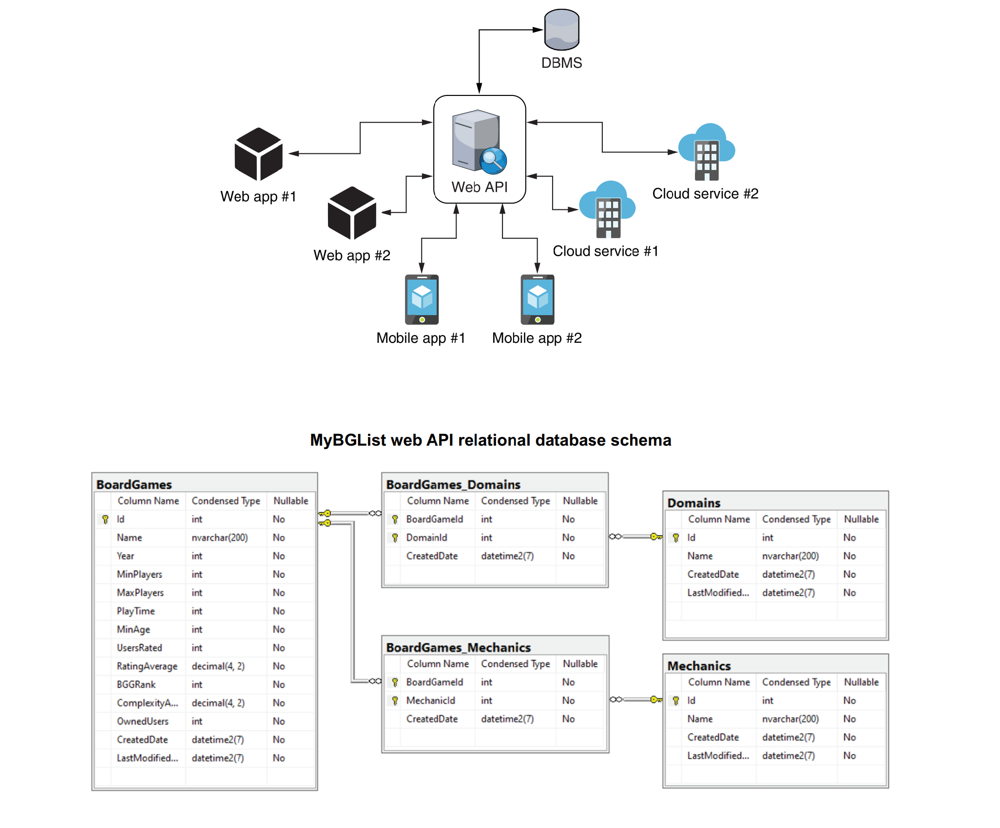

# BoardGameList API

Board Game List is a web application that provides a comprehensive database of board games with real ratings from clubs. 
Users can browse, search, analyze rankings, and access club-specific statistics.
This is a specialized .NET 8 Web API for managing and filtering board game collections 
featuring custom OpenAPI/Swagger filters for advanced query parameter documentation and is optimized for deployment on Linux/Ubuntu environments.

## 🚀 Features
- **.NET 8 Core**: High-performance API using the latest Long Term Support (LTS) framework.
- **Custom Swagger Filters**: Enhanced API documentation using `IParameterFilter` to handle dynamic key-value pair filtering.
- **RESTful Architecture**: Controller-based design following industry best practices.
- **Production Ready**: Optimized configuration for Ubuntu servers using environment variables for sensitive data.

## 🛠️ Tech Stack
- **Framework**: .NET 8.0
- **Documentation**: Swashbuckle.AspNetCore 6.6.2 (OpenAPI 1.6 engine)
- **Annotations**: Swashbuckle.AspNetCore.Annotations 6.6.2
- **IDE**: JetBrains Rider (macOS/Linux/Windows compatible)

## 🏁 Getting Started

### Prerequisites
- [.NET 8 SDK](https://dotnet.microsoft.com/download/dotnet/8.0)

### Installation
1. Clone the repository:
   ```bash
   git clone [https://github.com/DinhNhat/boardgame-list.git](https://github.com/DinhNhat/boardgame-list.git)
   cd boardgame-list

### API Documentation
Swagger UI available at: https://boardgame.nhatntu.live/swagger

